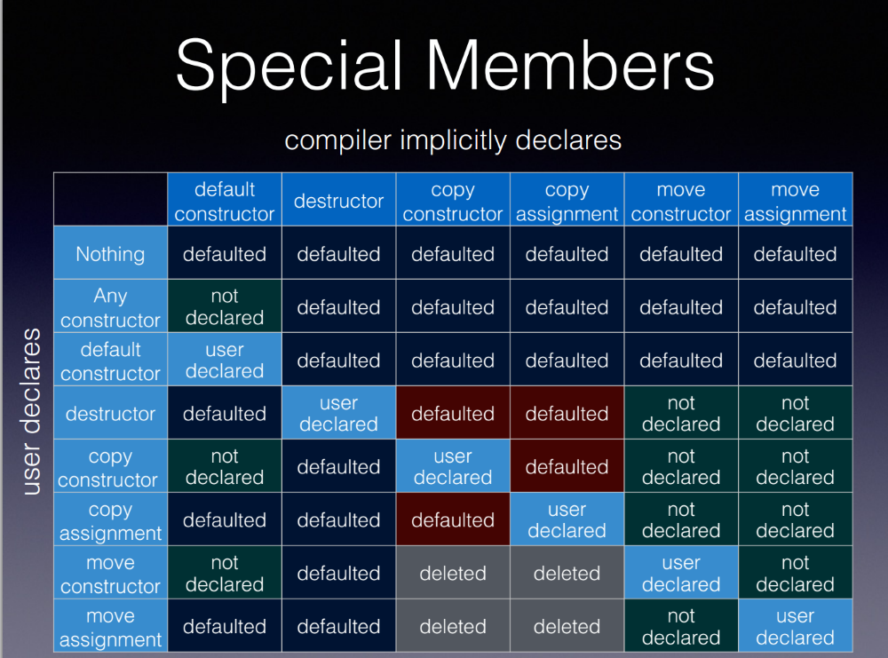

# C++ Cheatsheet
Quick lookup of arbitrary C++ rules

## Introduction
During the years I started to write very concise notes of C++ to quickly look up what I was missing. This became a very random set of cheatsheet entries, subjectively representing my learning. I intend this repo to have a permanent, formatted, structured storage for myself, but it can be used (and contributed) by anyone finding it.

This document isn't meant to be complete, and isn't meant to be used as learning material. Instead it's a memory refresher for a randomly picked set of topics that has caused problem for me since I started to learn C++.

The document consists of 4 bigger parts:

- **Everything you wanted to know about C++ but never dared to ask**
    - Fluent text explaining concepts in plain language
    - Subjective, explained in a way that helped me
    - Mostly contains topics I haven't seen in tutorials, or not in this way
    - Handpicked topics
- **Short facts**
    - Classic cheatsheet style sections
    - Very short lookup of things, like what kind of casts are there or what type of smart pointers exist
    - Also very randomly chosen what's in
- **The "VS topics"**
    - Comparing solutions that solve the same problem, but are slightly different
    - For quickly looking up things that are easy to confuse
- **Rules of thumb**
    - Quick rules and guidelines
    - Good to use for self check
    - Might be used during code review
    - There are extensive guidelines for C++, this is more like a quick checklist for myself, also subjectively collected

## Everything you wanted to know about C++ but never dared to ask

### How the compiler works

This quite long part will be more like a fluent text of training material, since I am also learning it as I am writing it. My goal is to collect a good training material, just short enoug, to satisfy the needed knowledge to develop. I have never seen such a collected material containing why things are the way they are, why and how it is different from other programming languages, which is weird, as compiling and linking is a very important and basic topic.

So the basic idea is the same as in other programming languages: split the code for the sake of modularity and reusability.

#### How does C++ find function definitions if I never include the `.cpp` file?

In my examples I will talk about functions. This is only for the sake of simplicity, these toughts apply to practically anything you can "import" in the general sense, like classes, constants and other exotic animals.

Knowing other programming languages, I brought some assumptions to C++ that turned out to be false. This caused some confustions. Normally I would just explain how C++ works instead of detailing my wrong assumptions, but I know for sure there are other people who got the same confusion. I had those "click" moments when I realized some simple things, but no one bothered to tell me those, I guess because it was obvious for them. No matter how experienced colleagues I had, how good video tutorials and blogposts I was consuming, there were some things no one has ever told me. So now I will tell you things that would have helped me in a very simple way.

The base problem is, when you have code spread over multiple files (kind of always) every programming language has to have a mechanism to find the corresponding function definition for a function call. When you call a funcion, *some code* is executed in the end of the day, and a machine has to be able to find the function body starting from the function call, otherwise the code would be impossible to run.

When I debug a JavaScript code and see a function call, I scroll up and it has to be obvious which `import` statement brought it in. That statement has a reference to the file, and all I need to do is to follow it. The file I found this way either has the function definition or some kind of forwarding, so I might need to do further steps, but eventually I have to be able to follow the links until I find the definition. I am really sure the chain of links can be followed, because this is exactly what the interpreter does to find the code to run, and if an algorithm can do that, I can do that manually. Otherwise I wouldn't be able to run the code.

Pretty much the same thing happens in other languages. In Python you don't see the explicit path in the code, but there is a register in `PYTHONPATH` where the package names can be resolved to folders and eventually `.py` files. Point is, following the imports, you will eventually find the definition of the function.

Based on my vague memory, C# and Java do something similar.

When I was a beginner C++ developer, I was thinking "yeah, it is called `#include` in C++, but that's just a slightly different word". So when we used classes, we included them. We had to include the header files, but I accepted, okay we separate the interface from the implementation, because that's how you do it in C++.

But I was very confused by some basic things. Let's say we wnat to use the `MyClass` to our client code, let's call it `main.cpp` for simplicity. `MyClass` has two files, `MyClass.h` and `MyClass.cpp`. In `main.cpp` we import the `MyClass.h`, which looked like what I expected. When I call a method of `MyClass` inside `main.cpp`, if I need to follow where it comes from, I follow the includes. I get to `MyClass.h`. But that doesn't contain the bodies of the functions. So my Python brain was thinking, okay, so I guess `MyClass.h` includes `MyClass.cpp` so I can follow the links to resolve the link to the function body.

But no. It's the other way around. It's `MyClass.cpp` including the `MyClass.h`. So how does it work? Both references point towards the `.h` file, and no one ever includes `MyClass.cpp`.

And this is because the `#include` statement might look a bit like the `import` in other languages, but it has a **totally different purpose**. This is the one thing that clicked me, the one thing that no one has ever told me:

> Unlike `import` in other languages, in C++ the mechanism to find the corresponding function definitions for a function call has **nothing to do** with the `#include` directives. These are two separate mechanisms.

The "danger" is that the whole thing with the `#include`s *look like* they do what the `import` in those languages, but they don't actually. And with that, you can get by for a while, but those subtle differences can cause errors and confusions that are really hard to understand without knowing the grounds.

The two mechanisms obviously are related in some way, but you need to understand the basics to understand how it works.

At first, let's try to forget about header files and even `#include` totally. Pretend you have never heard of them. They will come later.

#### Basic compilation - get a simple C++ file to executable

So the basic idea is to turn your text file (of C++ code, a.k.a. your *source code*) into executable binary. This is a translating process, and it's done by the tool called the **compiler**. Nothing weird so far.

To be simplified, when you compile your code, each of your files are translated into separate binaries. These are called **object files**, usually gaving the `.obj` extension.

Usually you have more than one file, and in some of your files you use funtions that are defined in other files. This means that these `.obj` files - despite of being binaries - don't make sense in themselves, they contain unresolved references. But it's not a mistake, this is how it should be at this stage. They will be connected later.

The first, important thing to understand is that the compiler automatically loops through *all* the source files, regardless whether they eventyally get used or not. The compiler is *not* following any links or dependencies, just compiles all the files, and generates the object files for them.

In C++ file is not a unit of anything. The goal is to compile your whole code, and a file is only and administrative unit of feeding your code to the compiler. But a file doesn't automatically mean a separate scope or any kind of structuring from the code perspectice.

As you will see later, the compiler doesn't even know about any references from one file to another, it handles files in separation without worrying about unresolved references. This might be a bit more complicated, but this explanation is enought for us right now.

Exactly because of the fact that C++ doesn't see files, just your code as a whole, the important and somewhat surprising fact is that **your source files *don't* need to refer to each other in any way**. If you call a `log` function within your `main` function, you *don't* need to tell your `main` function where to find the `log`. There is a separate tool called **linker**, and it's job is to find it for you. It will ensure that there is only one funcion like that in your entire project, so it will be unambiguous which one to use when you call it.

So I have to emphasize this a bit more, because this is also something no one emphasized for me.

Again, in JavaScript you can have two functions with the same name and parameter list, if they are in different files. It's no problem, because in the place of the usage it will be obvious which one you have imported. If you import them both, there will be a name clash, but then you can then alias one of the packages or something.

In C++ it's different. Think of C++ in a way that it doesn't have files at all, everything is in one globas storage. Every function must occur only once globally, you cannot have two functions with the same name and parameter list even in two very different files. (You can in different namespaces, but that's a different story.)

And here it is. This is your mechanism to find the function definition. If there is only one globally, that's the function to call. Simple.

```cpp
// log.cpp

#include<iostrem>

void log()
{
    std::cout << "Log this out" << std::endl;
}
```

```cpp
//main.cpp

// yes, something is missing from here, but not an `#include`. more on this soon

int main()
{
    log(); // magic, a.k.a. "linker" finds the definition in the other file
    return 0;
}
```

It means you don't need to refer to the other fils, there is no need to `import` at all. You just use a function, and it will be executed, wherever your definition is. So why the hell are there `#include` directives? Well, we will get to that soon.

So you can start writing code without any imports or such? Basically yes.

But you guessed, it's not *that* simple.

#### How does the compiler know I used the correct function? - declaration

Well, it depends on what do you call "correct". It's important to distinguish between the compiling and linking phases. These are practically executed by two totally separate tools, under separate times.

The compiler is not running your code, and actually in order to call a function, the compiler doesn't need to know what the function does. So it's not the compiler's job to ensure that the function definition exists.

But the compiler is doing *some* check for you to avoid certain mistakes. For example, if you call a function, the compiler checks whether you provide the argumnets with the correct types, and whether you use the return value in a correct type - or at least some implicit conversions can be made. The compiler can actually check a lot of things, these are called **compiler check**s, and you might not have it in those other mentioned languages such as Pyton or JavaScript. This is a huge benefit of the strongly typed languages such as C++.

But how does the compiler know what kind of arguments a function expects or what kind of return value it has if you don't "import" it or refer to it in any way? Good question. The compiler actually needs something to run the checks agains. This something is called **declaration**.

In C++ you can declare a variable, a function, a class, practically anything, and while in other languages the functions don't have a separate declaration and definition, in C++ you optionally can do them separately. This is a little bit similar to variables: you can create (declare) a variable without content, and fill it later, or you can do it in one step.

Sticking to the above example: you have a `main.cpp` where you use a `void log()` function. The definition i.e. *what* the function is actually doing is defined in `log.cpp`. The `main.cpp` doesn't need to know it. It only needs to know it's name, return type and parameter list with types. This is called the **function signature**. So in `main.cpp` you need to *declare* the function, using the functions's *signature*, something like this: `void log();`. This is the same as the function's definition, but instead of the curly brace block, there is just a semi colon. It is very important to have exactly the same signature in `main.cpp` and in `log.cpp`, that's how the *linker* will match the definition to the usage. But you still don't tell the `main.cpp` *where* to find the definition. Additionally this declaration is enough to tell the compiler how to run those checks.

This is a perfectly fine program with two files. Note that there is no `#include` or any reference to `log.cpp` in `main.cpp`.

```cpp
// log.cpp

#include<iostrem>

void log()
{
    std::cout << "Log this out" << std::endl;
}
```

```cpp
//main.cpp

void log();

int main()
{
    log(); // magic, a.k.a. "linker" finds the definition in the other file
    return 0;
}
```

To sum it up, in order to use a function (or class or variable or whatever) you don't need the definition, but you need a declaration. A declaration is enough information for the compiler to run the compiler checks. It's like saying: hey, don't worry, this funciton exists, and it looks like this.

Note: sometimes we talk about **forward declaration**. A forward declaration is just a declaration, nothing technically different. It only means that you declare something in the code before you define it, so practically you let the compiler to work with something you haven't defined yet. For a class, it might be as simple as `class MyClass;` just telling the compiler "don't worry, we have a class called `MyClass`, it will be defined for the linker, trust me".

#### So then how does the *linker* know I used the correct function?

If you declare and use something in a file without definition, and simply just compile it, it will result in an unresolved reference in the object file. It's fine, because - as we mentioned - it's not the compiler's job to find those things. It also means that the object files in general case cannot be ran in themselves - they are incomplete programs.

With other words, the compiler only considers files in separation, and it's the linker's job to see your project as a whole.

It's the linkes's job to resolve those unresolved references. So if you are using this undefined `void log();` function in your `main.cpp` basically you can run into 2 linking problems: after searching in the object files the linker either doesn't find a definition at all, or finds more than 1 of them. Both are linking errors, meaning your final program cannot be created.

So it's important that among all the object files there is one and only one function definition that matches *exactly* the declaration you have.

Wait, does this mean that I could write my whole code without my files actuall referring to each other, relying on the linker to magically find the definitions of everything I use?

Practically yes, but it would be terrible. Because there are some problems with it.

#### How do I know what to declare? - introducing the preprocessor

We used the example of an extreme small program, consisting 2 files, one defining a function (`log.cpp`) and the other one using it (`main.cpp`). In this case you defined a function in `log.cpp`, and you had to add a corresponding function declaration to the `main.cpp`. It means that the `main.cpp` needs to have prior knownedge of what function(s) the other file has, and additionally if you or someone changes `log.cpp` all usages needs to be changed to keep the declaration(s) in sync with the definition.

If you don't have many files, and you are the author of all of them, it might be fine. But one of the whole point of separation of files is reusability. You probably created the `log()` function in a separate file, because you want to use it in several places. If they all need to declare the functions the same way, it is cumbersome and error prone, especially when a change happens in the `log.cpp`. Not to mention 3rd party libraries where you just use a huge file without exactly knowing the function signatures.

So what is the solution? Could the file, which have a definition somehow publish the declarations so all the clients just need to "pull" them in?

So we have reached the point where we actually start to need some kind of import statement.

While most of the modern languages have sophisticated ways to refer to other files, in C++, and earlier in C, they have found a very simple solution. They just made a separate tool that can copy-paste code from one file to another. The idea is that you have specific directives to this program, and it does text modifications to practically generate the C++ code for you. With that you can have the declarations in one single, central place, and all the clients could just automatically copy them into themselves. And this is the `#include` statement. You might probably already know that the `#include` just finds the target file, takes its contents as text and literally copies it in the place of the `#include` statement.

So this is - again - another and last tool we mention. Since it processes text (takes textfiles and input, and produces textfiles as output), and results in proper C++ code that is fed to the compiler then, it's called **preprocessor**.

There are other preprocessors out there, the common in them is that, unlike a programming language, they don't result in executable code, but instead result in another formal language. The source file of them is usually a mix of the target language and directives to the preprocessor just like your source code has a mixture of C++ and preprocessor directives.

*(Side note: another well-known preprocessor is PHP which is an html preprocessor, and actually means **P**hp, **H**ypertext **P**reprocessor, being a recursive abbreviation. And similarly, a PHP code is usually a mixture of html and PHP code. If you feed that code to a PHP preprocessor, it finds the PHP parts, executes them, replaces them by html and - in normal case - results in a valid and pure html file.)*

This is nothing different with our preprocessor that resolves the `#include`s, and other preprocessor directives, for example macros or conditions that can include and exclude C++ source code based on certain conditions.

The `#include` is not at all some kind of sophisticated reference that gets resolved during compile or runtime. Think of it literally as copy paste. You can literally have a file containing only a closing curly brace, and in another file with a function that misses the closing curly brace, but includes the previous file there. The preprocessor will simply paste the curly brace and the compiler will only see a properly closed function.

One note here is that since the preprocessor by its nature runs before the compiler, the compiler doesn't know about the preprocessor directives. The compiler gets the pure C++ files, where all the `#include`s are already replaced by the contents of the included files. In this sense the compiler doesn't have and cannot have files that point to each other, for the preprocessor they are really just standalone files.

Since the `#include` directives can somewhat change the original file structure, the compiler doesn't necessarily get exactly the file structure how you created it. That's why there is a subtle distinguish: the files the compiler gets are called **translation units**. So one `.obj` file is created for one translation unit. If you include a source file from another, 2 files might be merged, resulting one `.obj` file from files that were 2 separate `.cpp` files in your source code. That's why sometimes we talk about files, sometimes translation units. Most of the cases one `.cpp` file is one translation unit, so it's kind of think of them as the same thing.

Another note is that because of how the `#include` works, it *does* matter where you put your include directives, as well as their order. Altough in normal cases they should be independent, it might happen that they depend on each other and having the wrong order might cause errors or (maybe worse) hide existing errors and just work when they shouldn't. But more about that a bit later.

So why we had to discuss all the mechanisms with linkers and magic dependency resolution without imports and everything if we end up still including the dependencies? Can I just pretend its Python and `#include "log.cpp"` in my `main.cpp`?

No. You would very soon get an error.

#### Why cannot I just define a function and include it? - introducing the header files

If you define a function called `log()` in `log.cpp`, and then include it in the `main.cpp`, you will get an error. Being super experienced in Python, JavaScript, TypeScript, Java, C# and even PHP you are confused. Isn't this how you should publish your code?

No, not in C++. Remember, what we discussed.

C++ loops through *all* the source files. First, it runs the preprocessor, resolving - among others - the `#include` statements, that are simply text copies. At this stage the whole contents of your `log.cpp` get copied into `main.cpp`.

Before the preprocessor:

```cpp
// log.cpp

#include<iostrem>

void log()
{
    std::cout << "Log this out" << std::endl;
}
```

```cpp
//main.cpp
#include "log.cpp"

int main()
{
    log(); // magic, a.k.a. "linker" finds the definition in the other file
    return 0;
}
```

We have also discussed that it might be okay for the compiler, since all the files work standalong, but when the linker goes through all the object files, it will notice that there is 2 definitions of `void log()` function in the global scope. One in the original file `log.cpp`, and one in `main.cpp`, because the `#include` directive copied it there. Since you cannot have two definitions of the same function, that is an error.

After the preprocessor:

```cpp
// log.cpp

// contents of iostream ... lots of lines

void log()
{
    std::cout << "Log this out" << std::endl;
}
```

```cpp
//main.cpp

// contents of iostream ... lots of lines

void log()
{
    std::cout << "Log this out" << std::endl;
}

int main()
{
    log(); // magic, a.k.a. "linker" finds the definition in the other file
    return 0;
}
```

Let's recap what we have done so far?
- We can actually define a function in a file, and call in another without having any explicit connection between the two files, but we need a declaration in the place of the usage
- We can actually copy the contents of a file to another, and to many others making it possible to centrally declare or define something and spread it over to many files
- Including definitions to other files usually cause problems as they result in multiple definitions of the same thing

So how should we solve this?

Remember, in the places of usage, we only need the *declarations*, not the *definition*. So the idea is to have a file, where we only store the *declarations*, and the clients only have to `#include` that file.

In our example there will be the original `log.cpp` file with the *definition* of `void log() {/*...*/}`, and another file, which contains the *declaration*: `void log();`. Our `main.cpp` can `#include` the file with the declaration. So in this case `main.cpp` doesn't need to explicitly type down the declaraion of that funciton. In fact, if there are several files using the same log, all they need to do is to include the file with the declarations.

But wait, isn't it a problem that there will be the same declaration all over the place? If I include that file to 10 places, the linker will find the same declaration 10 times. Yes, it will. But that's no problem.

When the computer (whichever mechanism in whichever language) has to find the code to run, that must be unique, because at the end of the day it needs to run some code. That's why in C++ the definition needs to be unique. But we don't have a reason to limit the number of declarations, so including the declaration many times doesn't cause any linking problems.

You can even repeat the same declaration over and over again in one single file:

```cpp
void log();
void log();
void log();
```

It doesn't make sense, but technically it's not a problem.

So where are we now? Should we create a `log_declarations.cpp` file? Something like this:

```cpp
// log.cpp

#include<iostrem>

void log()
{
    std::cout << "Log this out" << std::endl;
}
```

```cpp
// log_declarations.cpp

void log();
```

```cpp
//main.cpp
#include "log_declarations.cpp"

int main()
{
    log(); // magic, a.k.a. "linker" finds the definition in the other file
    return 0;
}
```

Well, that is one option. Technically it would work. But this file would only be used by other files via the `#include` directive, never as a standalone file. It means that there is no point of compiling this file into an object file. It's safe to skip it. And since compilation is a long process, it would be quite a huge waste of time and resources to compile these files in themselves.

We need a way to tell the compiler to leave these special "declaration files" alone.

These "declaration files" have a special name: they are the famous **header files**. By convention, they have the extension `.h` or `.hpp` or `.hxx`. These extensions could be anything, you can set your compiler's settings to anything, but these are the most commonly used conventions, as well as the default settings to practically all the compilers, so if you don't specify otherwise, your compiler will treat these as header files.

```cpp
// log.cpp
#include "log.h"
#include <iostrem>

void log()
{
    std::cout << "Log this out" << std::endl;
}
```

```cpp
// log.h

void log();
```

```cpp
//main.cpp
#include "log.h"

int main()
{
    log(); // magic, a.k.a. "linker" finds the definition in the other file
    return 0;
}
```

So, again what the client code needs to do is to include the header file. It only "pulls in" the declarations to perform compiler checks, but it doesn't resolve the reference to the actual definition. That is done by a totally other process, performed by the linker.

So usually when you create a new library or class, you always create 2 files: a header and an implementation file, the header containing only declarations, and the `.cpp` implementation file specifying the actual function bodies. And then the `.cpp` file includes its own header, so it knows about its own declarations, that are most important in case of classes, because otherwise you cannot implement member functions outside the classes.

Note that having a matching pair of `.cpp` and `.h` files is a convention, and not a technical requirement. You can have a header file to declare a class with several class methods, and implement those methods in totally different `.cpp` files that are all over the file structure and have names different from the header file. It's fine. But for simplicity we usually have the `.cpp` and `.h` together, with the same name, otherwise it would be confusing.

##### Why does the implementation include its own header?

So in our case, why does the `log.cpp` include the `log.h`?

In this simple example it's not important. But, for example in classes, you declare a class in the `.h`, and the corresponding class method definitions in the `.cpp`. You couldn't do that without having the class declarations.

Also, if you only have a set of functions in the `.cpp`, if you include the header, you will have forward declared all of them, so all of them can refer to any of the others.

It's also beneficiary to have knowledge about the exact signatures you promise to the outside world, so it's easier to make sure you actually implement the functions the outside world is using.

Phew, that was long and complicated, let's do a summary.

#### Let's summarize so far

- In C++ you can obviously define a function, or class or whatever in a file and use it in another one
- Funciton signatures must be unique in the global scope, that's how the linker finds the definition to the usage
- Because of this, the place of usage (client code) doesn't need an explicit reference to know *where* to find the definition, but it needs a *declaration* to perform the compiler checks
- The place of definition is a `.cpp` file (usually), and along with that there is usually a header (`.h` or `.hpp`) file is shipped, only containing the declarations. The `.cpp` file includes its own header.
- Client code only needs to include the header file to obtain the declarations, so it will know what kind of functions and classes are published, and in order to perform the compiler checks.
- The preprocessor copies the declarations to the client code. Then the compiler compiles the `.cpp` files, but not the headers.
- Later in the linking phase the references to the implementations will be resolved by the linker.

#### Some notes and clarifications

- Normally you should never include `.cpp` files, only headers, to avoid double definition errors.
- It might not be necessary for a `.cpp` file to include its own header
- While in other languages you can find function definitions starting from the function call and following links of imports, you cannot do that in C++. C++ is more like a global blob where functions have to be unique
- Mechanism to find the corresponding definition to a function call **has nothing to do** with the `#include` statements.
    - The `#include` statements are to have a central definition for declarations which is important for static checks performed by the compiler
    - The link resulution is done by the linker at a later stage exploiting the fact that there is only one of every function signature

##### Some smart checks

This is an optional topic, only read it if you want to deep dive into the subtleness of C++ compilation and linking.

IDEs do some smart checks, showing some weird configurations might actually work. Also the compiler and linker are smart, and only those cases fail that actually cannot physically run.

Let's say you have `MyClass.h` and `MyClass.cpp`. As normal, you declare a class called `MyClass` in `MyClass.h`, and you specify definitions in `MyClass.cpp`. `MyClass.cpp` includes `MyClass.h` just like normally.

```cpp
// MyClass.h

#pragma once

class MyClass {

public:
    void method();
};
```

```cpp
// MyClass.cpp

#include <iostream>
#include "MyClass.h"

void MyClass::method()
{
    std::cout << "MyClass::method() called" << std::endl;
}
```

Now let's say you have a member of this class of type `Foo`, declared in `Foo.h`. You need to write something like `Foo foo;` in the `MyClass.h`. You might guess you should include `Foo.h` in `MyClass.h`.

```cpp
// MyClass.h

#pragma once
#include "Foo.h"

class MyClass {

public:
    Foo foo;
    void method();
};
```

```cpp
// MyClass.cpp

#include <iostream>
#include "MyClass.h"

void MyClass::method()
{
    std::cout << "MyClass::method() called" << std::endl;
}
```

But since you don't compile header files, it's okay to use it in `MyClass.h` and include `Foo.h` in `MyClass.cpp` as long as `MyClass.cpp` is the only file including `MyClass.h`. The only place your `MyClass.h` code will appear and being compiled is inside `MyClass.cpp` after the preprocessor has inserted it. And since you have the `#include "Foo.h"`, it will compile.

This is also perfectly working code:

```cpp
// MyClass.h

#pragma once

class MyClass {

public:
    Foo foo; // Used but not included here
    void method();
};
```

```cpp
// MyClass.cpp

#include <iostream>
#include "Foo.h" // Included here
#include "MyClass.h"

void MyClass::method()
{
    std::cout << "MyClass::method() called" << std::endl;
}
```

But I don't recommend it, as as soon as someone else includes `MyClass.h` (and they will, since it's the point of having header files), they either need to include `Foo.h` before that, or have a crash.

This is both a smart check that lets through things that work, but also a good example of dependent headers which you should never have.

There are some other things that are weird but work:

- It is okay to declare and not define a function as long as you don't use it. Missing implementation is a problem for an actual function call. In this case both the compilation and linking will succeed.
- Tough if you call the missing function in an unused function, it depends. If you have an unused function (dead code) that calls a function with the missing implementation, the compiler knows that other files might be using it, so it gives you an error. But if you mark it as `static`, making your dead code private to your file, the compiler will validate that noone is using that function call, so you are essentially calling the missing function in dead code, and you will get no errors.

```cpp

/*
This is not OK, as we don't know who will include this file and call `deadCode()`
In that case `undefinedFunction()` would be called causing an error,
*/

#inclue <iostream>

void undefinedFunction(); // This function has no definition in other files either

void deadCode()
{
    undefinedFunction();
}

int main()
{
    std::cout << "I do something unrelated to those above functions..." << std::endl;
    return 0;
}

```

```cpp

/*
This is OK, because marking `deadCode()` static we made sure it's invisible for the outside world,
and it can be called only from this file. The compiler and linker can know that no one calles this
function, so also `undefinedFunction()` doesn't ever get executed.
*/

#inclue <iostream>

void undefinedFunction(); // This function has no definition in other files either

static void deadCode()
{
    undefinedFunction();
}

int main()
{
    std::cout << "I do something unrelated to those above functions..." << std::endl;
    return 0;
}

```

- If you have a declaration of an undefined function, and even call it, the single file will compile into an object file without problem. Because it's the linker's job to follow the reference, and the compiled object files are not meant to be used standalone. It "believes" that the function will be defined somewhere. The linking will fail.

##### Why is it different in other languages?

There is an important fact I haven't emphasized yet:

> C++ doesn't care about file structure

Different files are not really different scopes.

JavaScript is an interpreted language, that starts to read one file and execute it. As it finds dependencies, it is dynamically bringing them in. What functions exist in other files, it doesn't even know about until they actually start to get used.

C++ has a compilation phase where the whole project is treated at once as one big scope. The linker sees everything, and there is no boundaries between files. That's why it needs to be unique, that's why there is no need for imports, but that's also why it is not only not needed, but even problematic to include one source from another. All source files are seen by the linker and they have to exist once.

Maybe there wouldn't evem be needed to have header files, if the comiler wouldn't do those checks, but we should be very glad that they do.

So as a result of this whole thing, eventually you use external code in your file, you will end up including the header, kind of where that code comes from. Similarly to how you import things in Python and JavaScript. But remember, it's not the same.

#### Summary of the compilation process

Generally there are 3 steps when your C++ code is turned into executable:

1. **Precompiling** - turns preprocessor directives into generated C++ code the compiler can read. Most common is the `#include`
2. **Compiling** - turn C++ code to separate binaries, that don't run standalone, called object fiels (`.o` or `.obj`)
3. **Linking** - link the object files together, for example resolve called functions that are defined in a different file

We see some of these in details now.

##### Compiling

The compiler parses, tokenizes the text and builds an abstract syntax tree. It is a semantic, working representation of the code instead of having it in practically one single string. The compiler then uses this to generate the binary.

It generates an `.obj` object file for each **translation unit**. A **translation unit** is often, but not necessarily is a `.cpp` file.

C++ doesn't care about files, file structure has no meaning to C++. (Unlike in Java for example.) A file is just a unit to feed the source code to the compiler. You tell the compiler what type of file it is, and how to treat it. It will treat the `.cpp`, `.c` and `.h` files as C++, C and header files (by default).

Every C++ file will be treated as a translation unit an will be resolved as a object file. It is possible tough to include one `.cpp` file to another and compile them as one translation unit.

### Heap vs stack

Our variables live in the memory. The memory has different parts. 2 of them are important to us: heap and stack.

#### Heap

There is one big piece of memory called **heap**. It lives during the entire time of the program, and pieces of data stored here are not connected to a specific function.

#### Stack

On the other hand, when a scope is opened, for example the control goes into a function, an `if` block, or just an empty block, a new part of memory is allocated to store the local variables there, and it's called a **stack frame**. As soon as execution leaves the scope, the stack frame gets destroyed, and all the memory allocated in it gets automatically freed. C++ makes sure that all the destructors are called automatically on reaching the closing brace `}`. The stack has a predefined size, usually around 2 MB.

The stack works as a LIFO (last-in-first-out) register, that's why it's called stack, meaning the first stack frame to be destroyed is the one which was created last time. For example the function that will return next is the one that was called last.

A stack frame is where the local variables live (except `static`, but don't confuse outselfes now). If you call the same function many times, for example in a recursive algorithm, all the function calls have their own instances of the local variables, because every function call has its own stack frame. This is how the eariler calls can remember their own values.

#### Comparison

The heap and stack have different structure which results memory allocations to be much faster in the stack.

Every new pointer initialized with the `new` keyword or using `malloc` is allocated on the stack, while "normal" local variables are allocated in the stack.

Note that not all pointers are pointing to heap allocated data. You can create something on the stack, and it's totally normal to have pointers to point to them.

```cpp
MyClass* my_heap_object = new MyClass(); // Heap allocation

MyClass my_stack_object = MyClass(); // Stack allocation

MyClass* my_stack_pointer = &my_stack_object; // Pointer pointing to a stack allocated object
```

One advantage of the stack is this incomparably better performance. The other benefit is that its less error prone, because the allocated memory gets freed up automatically, while in case of heap allocation you need to do it yourself.

The heap has some advantages over the stack: it's bigger, and anything stored in it survives the scope. Also, variables in the heap 

> Rule of thumb: use the stack whenever you can. Meaning, you should use heap allocation 1) if you need data that survives the scope, or 2) you have data that is huge (like an image). Also you can only use the heap to allocate dynamicly growing data, like a `std::vector`.

### What is "ownership"

Raw pointers point to obects in the heap. They need to be manually deleted (i.e. memory needs to be freed to not cause a leak). When data is created and destroyed in the same scope, it's not complicated, but in this case use of pointers is often not needed.

Pointers are often passed down functions and complex features, or returned by a factory, and you need to keep track of whose job is it to delete it.

> Ownership means “responsibility to cleanup”. The owner of the memory is the one who has to delete its pointer.

Deletion can either be explicit (through the keyword `delete` of the function `free()` regarding raw pointers) or bound to the lifetime of an object (through smart pointers and RAII), meaning typically that an explicit deletion happens in the destructor of the owner.

Ownership is not a builtin concept to the language, it's more like an approach to make sure heap allocated memory gets freed, and there is one or more entities at all times whose responsibility is to delete, kind of a best practice if you like.

More on that in this very good article: [Who owns the memory?](https://belaycpp.com/2022/03/17/who-owns-the-memory/)

#### RAII

RAII (Resource Allocation Is Initilaization) is a concept of having stack allocated objects owning heap allocated objects. They allocate memory in the constructor, and delete them in the destrucor. If in your client code you don't use the heap object direcly any more, only the stack object, you get rid of the coupling (i.e. your responsibility to not forget to delete if you allocated), as your objects will be deleted automatically when the scope ends. Smart pointers do exactly this for you, but it's totally okay to implement your own logic as an alternative to smart pointers, if you need to (but don't reinvent the wheel).

In RAII the lifeime of the heap object is bound to the lifetime of a stack object. You might think you loose the advanage of heap object surviving the scope, but that's not the case. The RAII object can get its internal poiner and hand it over to another object, like pass it to a function.

This is called moving the ownership, and a whole topic is organized around it, called **move semantics**, in conrast of **copy semantics**.

### Copy semantics

Copying the actual data of the object to another object.

- **Shallow copy**: e.g. you copy an object, but if it has pointers and references, you only copy the pointers and references. The new object will have its own pointers, but they will point to the same resources.
- **Deep copy**: copying the whole object recursively, copying the underlying pointed at objects as well.

*Note*: if you perform shallow copy, be careful about the ownership. Both objects might point at the same data, and if both of them try to delete it, it might cause problems.

Copy semantics is higly connected to copy constructor and copy assignment operator. You can read more about these in [Special member functions and their rules](#special-member-functions-and-their-rules).

See also `memcpy`, a function that does a bitwise copy regardless of types or null terinating characters.

### Move semantics

Move means moving [ownership](#what-is-ownership). Simply saying, moving an object means that some part of the code has a pointer to it, then the other part of the code starts to point at it, then the original object releases it:

To move a house from Alice to Bob has these steps:

1. Alice: this is my house
2. Bob: this is my house (now they both point at it)
3. Bob: Alice, this is not your house any more (to be more precise: "your house" is a nothing from now on)

From now on Bob can refer to the house's resources, and it's Bob's responsibility to delete the house when he doesn't need it any more. Alice doesn't need to think about deletion, it's not her job to prevent memory leaks any more.

With this logic you can pass a complex object from one scope to another without copying or duplicating anything in the memory.

*Note*: we often talk about moving as moving the data from one owner to another, while the whole point is to not touch the object physically in the memory. It might be confusing to say we use *move* so the data can stay where it is. So you can either think of moving as as abstract moving from one owner to another, or more like to move the ownership rather than the object itself, like referring to selling a house as "moving the house from one owner to another", while the house is actually not pysically moving.

While the concept is simple, C++ has builtin techniques to support this logic.

#### rvalue reference

Move semantics are highly bound to [rvalue references](#lvalue-vs-rvalue).

To be short, an rvalue reference is a reference to a nameless, temporary object. As they are temporary, they are safe to be moved from.

#### Move constructors and move assignment operators

They are similar to the copy constructors and copy assignment operators.

The technical difference is that - while copy operations accept reference or the object itself, a.k.a. lvalues, - the move operations accept rvalue references. Again: **copy: lvalue, move: rvalue**.

The semantic difference is that they should just start pointing to the resources of the object they got in the parameter ("stealing" its resources), and then invalidate the origin (creating a hollow object with `nullptr`s).

In case of move assignment, it's important to check if the origin and destination is not the same (`&other != this`), otherwise when you make the origin release the resource, `this` releases them too so no one has the pointer any more.

The original object owner does not get destroyed during the copy itself (Bob doesn't kill Alice by aquiring her house), but the original's pointer gets invalidated. It means that Alice still has a pointer to a house, but it's an invalid nullpointer. So when Alice normally goes out of scope, she can safely delete her pointer, a.k.a. freeing up the resources she is pointing at, because that will not point to an actual address any more, like sending the demolition crew to a nonexistend address. They will no destroy any houses. Bob can keep using the house.

Epmhasize again, that invalidating the original's pointer is important, because oherwise if the original owner goes out of scope it will probably try to delete the resource. If it still points to the resource, it will delete the real resource and the new owner will also be unable to use it.

**Move constructor**
```cpp
MyClass(MyClass&& other) {
    // Transfer resources from 'other' to 'this'
}
```

**Move assignment operator**
```cpp
MyClass& operator=(MyClass&& other) {
    if (this != &other) {
        // Transfer resources from 'other' to 'this'
    }
    return *this;
}
```

Move constructor is called when we assign a value to a newly created object, and move assignment operator is called when we assign to an already created object.

```cpp
MyClass my_object = std::move(something) // move constructor
my_object = std::move(something_else) // move assignment operator
```

#### `std::move()`

In pure terms of function overloading, if we want the move happen instead of copying, we need to call the constructor with an rvalue reference. That's how the compiler can distinguish which one we are trying to use. It means, if we have an lvalue and want to move it, we first explicitly need to cast it to an rvalue reference. Practically that is exactly what `std::move()` does.

```cpp
MyClass origin;

MyClass destination1 = origin; // Copy constructor is called

MyClass destination2 = (MyClass&&)origin // Move constructor is called

MyClass destination3 = std::move(origin) // Essentially the same as above with nicer synax (actually static_cast under the hood)
```

Note: `std::move` doesn't actually move an object, it just creates a temporary object from it, so it is safe (and possible) to move from. In the above example the moving happens "in the `=` sign" and not in the `std::move`.

#### Are move constructor and ass. operator and `std::move` the same as move semantics?

No, move semantics is the concept of moving ownership while not touching the pointed at object in order to pass data around, instead of copying it by value. Move constructor, move assignment operator and `std::move` is just some language concepts to help with it, but you can implement your own solutions.

#### Can I implement move semantics in a copy constructor? Or are these magically enforced?

With other words, can I misuse the intention of any of these?

Yes. You as the programmer has the responsibility to fill the functions' body if you decide to override default functionality. You can use it in a correct and incorrect way. So for example having a copy constructor doesn't automatically enforce that an actual copy will take place. But *please* if you implement any of these, do it in a way they do what they promise.

### Why do I need `virtual` keyword and use pointers to achieve runtime polymorphism?

In programming, it's common to have different classes that have a common base class.

All the classes inherit a function from the base class, but they have their own implementation.

If - for example - there is a function that should handle all of them, it accepts a parameter as the base class, since all of them *are* the base class too. But when you call the function on the class, you want the current child instance's funtion to be run. This is called **runtime polymorphism**, and many design patterns use it as well as many solutions in everyday programming.

In C++ you need to do 2 things to achieve this:

1. Declare the funtion ``virtual` in the base class. If you don't do that, the base classes funciton will be called.
2. Use the instances of the object as a pointer to the base class type. If you use normal objects, the base classes funciton will be called.

```cpp
#include <iostream>
#include <memory>

class Animal
{
public:
	virtual void print() const
	{
		std::cout << "This is an animal" << std::endl;
	}
};

class Cat : public Animal
{
public:
	virtual void print() const override
	{
		std::cout << "This is a cat" << std::endl;
	}
};

void run_virtual_demo()
{
	Animal animal;
	Cat cat;
	Animal cat_as_animal = cat; // Slicing happens here, cat looses its "catness"

	animal.print(); // This is an animal
	cat.print(); // This is a cat
	cat_as_animal.print(); // This is an animal - should be a cat

	std::unique_ptr<Animal> cat_as_animal_ptr = std::make_unique<Cat>(cat);
	cat_as_animal_ptr->print(); // This is a cat - polymorphism achieved!
}
```

These both always bothered me.

First of all, why do I need to write `virtual`? Shouldn't it be automatic? What is the usecase when I *don't* want polymorhpic behaviour?

Even if there are some use cases, isn't that rare? So why isn't the virtual behaviour default and preventing override an explicit feature?

And second, why on earth it doesn't work with objects? It just seems a very random restriction that a very basic feature that has apparently nothing to do with pointers only work with pointers.

The reason is practically historical, and goes down to the bases of how C++ an actually C works, and the short answer is, C++ is a language that works in a way only pointers can achieve runtime polymorhism. Period. But here is a little more detailed explanation why.

#### Why doesn't polymorphism work unless I explicitly mark the function as `virtual`?

When C++ needs to decide which function body to call belongs to a function call, it's called **binding**. Binding can happen at compile time (early binding) or at runtime (late binding). With the `virtual` keyword you are specifying to the compiler to use runtime binding.

Runtime binding performs no magic, it is actuall done by C++ code, but this code is generated by the compiler.

If you want to know more about it, google it, here is a short summary:

Something called a `VTABLE` is created, that is a static array of function poiners. This `VTABLE` is a static data member of the class. It contains function pointers, the addresses of all virtual functions in the class.

Then a poiner called `VPTR` is then generated for each object instance. This points to the function to call, but since it's a variable, which function to be called is now known at compile time, that's obviously why it's called runtime polymorphism.

Again, this is written in simple C++ code, but the compiler generates that code for you.

In case of "normal" (i.e. non-virtual) functions, this whole thing is not needed, and it should be unambigous at compile (actually linking) time, which function to call. It's much simpler, and doesn't need any special mechanism like the virtual functions do.

When you write the `virtual` keyword, you are asking the compiler to generate this mechanism for you.

*Ok, I understand the difference between virtual and non-virtual functions, but why is it different from other languages? Why do I have to do it in C++, while it's not needed in some other langauges?*

First of all, other languages, like Java or C# have the concept of virtual and non-virtual functions. When they design a language, they need a way for the developer to distringuish between the two. Different languages use different approaches. The simple answer is: this is how it works in C++.

It's important to emphasize, it's not a technical limitation, it's a *decision*. C++ could have been implemented in a way virtuality is default behaviour and you need to be explicit if you *don't* want it.

So there can be another question:

*If both ways work, and polymorphism seems to be the common usecase, why is non-virtuality decided to be the default behaviour?*

I don't know the why, but I have my own educated guesses.

Well, other languages work in the same (or similar) way, it's just a decision how to implement the language syntax.

In Java vitual is the default behaviour, and you need to specify explicitly if you *don't* want a function to be virtual, by marking the function `final`. But simply the fact that you don't write `virtual` explicitly doesn't mean that Java doesn't do all this lookup mechanism. It does. The creators of Java simply decided to use different usage of keywords.

In my opinion from the usage perspective this is logical, because if you override a function, you do this to achieve polymorphism, and it's very rare that you override a function and you don't want a polymorphic behaviour. The Java logic is that the more common usage has shorter syntax, because Java mostly cares about simple usage, behaviour and developer experience, but not performance.

On the other hand C++ logic reflects 2 things:
1. you need to be explicit if you want to add extra mechanisms, and C++ only does that if you ask it to, making sure it only happens when it's really needed
2. you *have to* mark functions that are meant to be overridden. You can make sure to retain the functionality if an accidental override happens by someone else which is not meant to.

So that's why you need the `virtual` keyword. But shouldn't polymorphism work with normal objects? Why is it that I can only use them with pointers?

#### Why doesn't runtime polymorphism work with normal objects, why only pointers?

[this section might be somewhat incorrect, handle it with care]

Since it's runtime data, it cannot be decided at compile time.

But to perform type checks, C++ compiler needs to know the exact type and size of a variable. You cannot do that if you don't know at compile time which class will be used at a place.

But a pointer to a base and a child is the same size (since both are simply integers), so you can safely assign a sublass type pointer to a base class type pointer without loosing data.

Note that type information is not encoded in the pointer itself. The type in only important for the compiler to know the size in the memory and to make sure only compatible types are used where should. This information is used, for example access members of a class, like "move the pointer 4 bytes to get the next element". After the code is translated to assembly or binary, no type info is stored or used any more, it's just data in the memory.

Take the following example:

```cpp
Base c = Derived();
```

In this case, `c` is not a derived instance any more, it's a base- In this case the copy constructor of base is called. Once I read, it's not like polymorphism doesn't work, it does, you call the method on `c`, and the base class method is called because it *is* the instance of the base class at this point. 

C++ inherits a lot of things from C, this is also something that comes from there. The basic reason is, the compiler needs exact knowledge of how big something is in the memory. A base class and child class can be obviously different in memory, so when you assign a child class instance to a base class type, it has to be "sliced off", and it also actually becomes the base.

We can imagine a kind of compiler that makes this work if the derived and base classes occupy the same amount of memory, but this is not the case in general.

Pointers, on the other hand don't occupy as much memory (in general) as the pointed objects, so you can have an *actual* derived instance in memory, and a pointer to it which thinks it's a base type, because actually it is. They occupy the same amount of memory, but it's type safe. (Because the child *is* a base.)

## Short facts

### `*` and `&` basics
- `*` -> **dereference** a.k.a. "pointed value". E.g. variable `a` is a pointer, `*a` is the value pointed at
- `*` is also declaring a variable that is meant to a pointer: `int *a` => `a` is a pointer to an `int`. Space placing doesn't matter, these are all the same:
    - `int* a;`
    - `int *a;`
    - `int * a;`
- `&` **reference** i.e. "address of": `a = 54` -> `&a` is the address, where the value `54` is stored at
- `&` is also declaring a variable that is a reference: `int& b = a;`. Space placing doesn't matter, these are all the same:
    - `int& b = a;`
    - `int &b = a;`
    - `int & b = a;`

### Pass array reference to a function

In C++ you cannot pass an array to a function. However, there are three methods for passing an array by reference to a function:

- `void functionName(variableType *arrayName)`
- `void functionName(variableType arrayName[length of array])`
- `void functionName(variableType arrayName[])`

### Special member functions and their rules

The functions (in certain cases) the compiler automatically generates for you (for class `A`):

- **Default constructor** - constructor without parameters and special behaviour: `A() {/*...*/}`
- **Destructor** - `~A() {/*...*/}` there is only one desctructor, and it cannot have arguments
- **Copy constructor** - constructor with one parameter with the type of (lvalue) **reference** the class itself (or const reference): `A(A& other) {/*...*/}`
- **Copy assignment operator** - `A& operator=(A other)` (obviously strongly connected to copy construction, see differences soon). Might accept the other by value or reference, or as `const` or `volatile`
- **Move constructor** - similar to the copy constructor, but it accepts an **rvalue reference** and uses move semantics: `A(A&& other) {/*...*/}`
- **Move assignment operator** - similar to the copy assignment operator, but accepts **rvalue reference** and uses move semantics: `A& operator=(A&& other)`

#### What happens when the user declares them explicitly

Via https://www.foonathan.net/2019/02/special-member-functions/



A couple of points need explanation:

- A “user-declared” special member function is a special member function that is in any way mentioned in the class: It can have a definition, it can be **defaulted**, it can be **deleted**. This means that writing `foo(const foo&) = default` prohibits a move constructor.
- A compiler declared “defaulted” special member behaves the same as `= default`, e.g. a defaulted copy constructor copy constructs all members.
- A compiler declared “deleted” special member behaves the same as `= delete`, e.g. if overload resolution decides to use that overload it will fail with an error that you are invoking a deleted function.
- If a compiler does not declare a special member, it does not participate in overload resolution. This is different from a deleted member, which does participate. For example, if you have a copy constructor, the compiler will not declare move constructor. As such, writing `T obj(std::move(other))` will result in a call to a copy constructor. If on the other hand the move constructor were deleted, writing that would select the move constructor and then error because it is deleted.
- The behavior of the boxes marked red is deprecated, as the defaulted behavior in that case is dangerous.

#### Copy constructor vs copy assignment operator

Both are used to initialize an object using another object of the same type, but there are small differences.

|**Copy constructor**|**Copy assignment operator**|
|--------------------|----------------------------|
|It is called when a new object is created from an existing object, as a copy of the existing object|This operator is called when an already initialized object is assigned a new value from another existing object. |
|It creates a separate memory block for the new object.|It does not create a separate memory block or new memory space.|
|It is an overloaded constructor.|It is a bitwise operator. |
|C++ compiler implicitly provides a copy constructor, if no copy constructor is defined in the class.|A bitwise copy gets created, if the Assignment operator is not overloaded. |

Note if you would like to prohibit copying, you need to delete both.

#### Move constructor vs move assignment operator

Similar rules apply to the move constructor and move assignment operator as well

#### Copy vs move

- Copy works with lvalue references and copy semantics (new memory is allocated and copied by value)
- Move works with rvalue references and move semantics (a pointer is set to an already initialized memory address)

Prefer move if you don't have a reson to copy as it's incomparably faster. Ever case is different, but some rules of thumb you can use move, if 1) you don't need to modify the value, or 2) if you actually want to make changes to the original value.

#### How the assignment operator works (`=`)

First of all, it checks if the right side has an rvalue reference or not. If it does, move semantics are used, otherwise copy.

- If you assign to a new value, the move/copy constructor is called: `MyClass my_object = other;`
- If you use it with an existing value, it's a move/copy assignment operator: `my_object = other;`

Copies value:
- If they are value types, e.g. normal int: `int b = a` will have different memory addresses. Changing `b` doesn't change `a`
- If they are pointers, `MyClass* b = a` will copy the address ("value" of the pointer itself), so they will point to the same data.
    - Changing `b` itself (e.g. the address, like `b++`) will not change `a`
    - Changing the referred value, e.g. `b->member = 3;` will change the pointed objects. While `a` itself doesn't change, `a->member` will have the new value.
- References: a reference cannot be reassigned, in their case the assignment operator actually copies the underlying, referenced value.

### Method pre- and postfixes

- `virtual`: the child classes method will be called even if you call it as a pointer to the base class. In case of a non-virtual method, the base classes method will be called. Mostly used to achieve runtime polymorphism.
    - Question: Why do I need to explicitly mark something as `virtual`? Why is "no polymorphsm" default behaviour, if runtime polymorphism seems to be one of the main reasons to have inheritance?
    - Answer: Virtual functions have some overhead and additioal complexity. The compiler needs to generate an array (VTABLE) keeping track of function pointers, and pointers (VPTR) to follow references in order to find the implementation. This is called dynamic, or late, or runtime binding. On the other hand non-virtual functions are bound at compile time which is simpler and more efficient.
    - But this usually doesn't cause a visible overhead
    - In Java every function is virtual by default, unless you mark it as final. So this is simply a choice of C++
- `static`: method doesn't get the `this` pointer as a hidden parameter. Function belongs to class instead of object instances. Can be used with or without instantiation.
- ` = 0` : a function is pure virtual and you cannot instantiate an object from this class. You need to derive from it and implement this method. You cannot declare a class abstract explicitly, but any class containing pure virtual methods are abstract. Only virtual functions can be pure virtual.
- ` = delete` : prohibiting calling (mostly used for disabling default behaviour, for example delete construction of singletons or delete the copy assignment operator and copy constructor to prohibit copying)
    - Any use of a deleted function is ill-formed (the program will not compile).
    - You can prohibit some default behavior, for example normally you can copy a class even if you don't explicitly specify a copy constructor. By deleting the copy constructor you can explicitly prohibit copying.
- `= default` : you can mark a function explicitly to use the default, compiler implemented version. This is redundant, same as not writing the whole thing at all. This just helps you to see what's happening so you don't have to know the rules by heart. See [Special member functions and their rules](###Special-member-functions-and-their-rules)
- `explicit` : The explicit specifier specifies that a constructor or conversion function (since C++11) doesn't allow implicit conversions or copy-initialization.
- `const` : the `this` pointer is const meaning the member function (method) cannot change the class members (prefer this if possible)

There are others, like `noexcept` these are the ones I found important to note down for myself.

### Ways to instantiate an object

```cpp
Entity entity(); // Calls the default constructor. Note that later initialization might be double work.

Entity entity; // Exactly the same as above. Not uninitialized, initialized by default constructor.

Entity entity = Entity("something") // Calls the specified constructor, then copies the created object to the newly created entity. Note that the constructor is called twice: 1) creating Entity on the right side, and then copying it to 'entity' by copy constructor. Not optimal.

Entity entity("somethign") // Same as above, just shorter in code

Entity* entity = new Entity("somethign") // Heap allocation, slower and manually  needs to be deleted, but survives the scope's end

Entity entity{"something"} // Called "uniform initialization". Object is initialized on the spot. Efficient and recommended way in modern C++. It can be used the same way all over, e.g. int:

int a{5}; // equals to int a = 5;

// Smart pointers
std::shared_ptr<Entity> entity("something");
std::shared_ptr<Entity> entity = std::make_shared<Entity>("something") // preferred
```

See more about uniform initialization here: https://www.geeksforgeeks.org/uniform-initialization-in-c/

#### Some notes about instantiation

A note about performance. If you create an object, and initialize it later, a copy or reassignment can happen. Do it in 1 step. 

Similar applies for initializer lists. They are better to be used, because setting members inside the constructor would mean duoble work: creating the object with default values, then reassign those values, while initializer list creates the object with the given values in the first place.

### The `static` keyword

- **Outside class of function** - internal to the translation unit ("private" )
- **Inside a function** - the value is permanent during the lifetime of the function, if the function is called several times, even recursively, all will share the same instance of that variable
- **Inside of a class before a function or member** - share memory with all of the instances, so one class has one instance insteas of every object has their own. Static functions don't get the `this` pointer passed to them.

### Cast types

- `static_cast`: most common, compile time safe casts (e.g. child class to base class). IDE can check usually
- `dynamic_cast`: mostly base to child, performs runtime check, returns `nullptr` if it wasn't successful. Can be used to check type of variable. (Similar cases when you would use something like )
- `const_cast`: modifies the constness of the target
- `reinterpret_cast`: converts pointer to different type without checking or modifying the pointed at data. Just starts to interpret the same data as a different type wihtout any considerations (type punning)

The above casts are the C++ casts, but you can use the casting type that come from C: there is the **C-style cast**: `(float*)a`. C++ casts use C-style cast in the background, but add some extra checks for a low overhead costs. If there is no other reason, C++ casts are preferred, but you are welcome to use C-style casts as well if you know what you are doing.

### Smart pointers

- `std::unique_ptr`
    - single owner of the underlying data
    - `std::unique_ptr<SomeObject> a = std::make_unique(SomeObject(...))`
    - you can directly construct it via consructor and pass it a `new`, but for exception safety, syntax and sometimes performance reasons `make_...` is preferred
    - cannot be copied
    - use this unless you have a reason to use `std::shared_ptr`
    - `.release()` releases the object and returns a raw pointer
- `std::shared_ptr`
    - reference counting, resource is released when *all* owners go out of scope or given up ownership
    - `std::shared_ptr<Object> p1 = std::make_shared<Object>("foo");`
    - Same comment here about `make_shared` vs constructor using `new`
- `std::weak_ptr`
    - used together with `std::shared_ptr`, but doesn't participate in referecne counting
    - because of it it might point to an expired value (see `.expired()` bool function)
    - If you want to use it, call `.lock()` that returns a shared pointer to the pointed object, or a default shared pointer if it's expired. Returned value can be used in an if statement to check validity.
- all
    - `.get()` returns the wrapped raw pointer
    - `.reset();` to release resource or set it to a new target

Note: `auto_ptr` is an deprecated and buggy approach that has been replaced by `unique_ptr` in C++11.

### `std::bind`

Creates a new std function with "predefined" arguments.
	
Example: let's assume we have a function called `f`, with 1 integer arugment. `std::bind(f, 3)` returns a function. The returned function has no arguments. If you call this function, it will call `f(3)`.
	
Placeholders:
	
`f1 = std::bind(f, 3, _1)`, you should call `f1(something)` and something will be substituted to `_1`, therefore `f(3, something)` will be called.

## Which one? The "VS topics"

Often there are multiple solutions to the same problem, that look similar, but have subtle differences

### Pointer vs reference vs value object

When to use which?

It's a complex question, but here are some points you can start from.

Normal objects and references are stored in the stack, while you might use pointers to refer to heap allocated objects. Note that a pointer can point to a stack allocated object too, if you alrady have it and set the pointer to its address.

Heap allocation is slower, and we need to take care about deallocation, meaning that whenever you can, you should prefer stack allocated objects, therefore you should only use pointers when you have to.

If you have to use pointers, prefer smart pointers, because thay at least take care of the memory management problem, but still have the problem with the worse performance.

General rule of thumb, for both performance and safety reasons, prefer your values like this:

> value < reference < smart pointers (unique < shared) < raw pointers

Where the items on the left have higher priority. If you have a value, start on the left, and if you cannot reasonably solve your problem with the concept, step one right.

**Normal variable (value object)**
- Lives in the stack, meaning:
- Quick to initialize (fast memory allocation)
- Automatic lifetime management (gets destroyed and memory freed when the scope ends with `}`)
- **When to use**: all the time when you can

**Rerefence**
- Wrapper around pointer (pointer with simplified syntax and some restrictions)
- No need to dereference or use "address of", can be used as a variable
- Unlike pointers, you cannot initialize a new one, only to point to an existing value
- Once a reference is initialized, you cannot change it (i.e. you cannot change what it refers too, but of course you can change the referred value)
- Not a copy, not a new address
- Practically works as the referred value, an alias
- `const` reference means you cannot change the referred value (unlike a `const` pointer where it's the pointer itself that's `const`)
- **When to use**: Passing value objects to other scopes when you don't need a copy and the use of the reference is within the lifetime of the referred object
    - E.g. pass const ref to functions so they can read the original data
    - Funciton parameters where the function has to change the original value
    - Return a reference *when the referenced object's lifetime extends beyond the function call* (e.g. referencing a static variable)
    - Often when overloading operators in user defined types, like copy/move constructor/assignment operator
    - Some classes have reference type data members when the class just needs to keep track of an external object (e.g. instance keeping a reference to a mediator). Value if I own it as internal implementation detail, reference if it lives outside the class but I need an address to reach it.
    - Aliasing: simply have different names for the same object if that improves readability
    - Other reasons might be also possible

**Pointer**
- Integer, storing memory address
- Type is no bound to it, type only tells the compiler, how long the memory is (both void, int, long etc. poiners are just one integer, pointer points to the first byte, but pointed data usually occupies additional bytes)
- When you initialize new data as poiner (`new` or `malloc`), it's always heap allocation
- **When to use**: when an object or reference is not enough for your goals. Including, but not limited to
    - When a variable needs to survive the scope and you cannot use references
    - When you need to achieve runtime polymorphism
    - Dynamic size arrays and data structures (actually static too)
    - Optional ("nullable") objects
    - Decouple compilation units to improve compilation time (see PIMPL idiom)
    - Resource management other than memory, like files or databases
    - Callbacks and function pointers
    - You use external code that expects them

In the following parts I will explain these in more details.

#### When to use pointers

The following points are examples of typical cases when you would need pointers. Here I am alking about both smart and raw pointers, where you should always prefer smart pointers unless you have a reason to use raw ones.

These examples are not complete, they just give you a gist of he most typical cases when using pointers is a better, or maybe only choice.

**When the variable needs to survive the scope**

If you pass around heavy objects between different scopes, for example construct something within a function and you return it, or the other way around, you need to pass something in to a function, there are multiple options for you.

You can move or copy the object. Copy is not performance effective, so you should avoid it if poissible.

You can also pass it by reference, and if you can, by all means, do that. But if the referenced object has ended its lifetime, using the reference might cause problems, so references are still somewhat bound to scopes.

Moving means relabelling the owner without actually touching the object, and this can be achieved by pointers. See more about it at the section about [move semantics](#move-semantics).

You can actually share it, remaining one of the owners, making the other function/class another owner, or you might just hand over a weak poiner so they can follow it but you remain the owner. All of these approaches need to use pointers, but some scenarios might have already written solutions that hide the pointers from you, like simply calling the move assigment operator.

So use pointers if another scope needs to access exactly the same object, but not a copy of it, and you cannot use references, because they are still too restricted by the scope.

**When you need polymorphism**

If you need polymorphic behaviour, you need pointers.

It means that a piece of code can work on different classes that have a common base class. It refers to the data *as* the base class (handling animals instead of cats or dogs), but runtime it will be one of the child classes, but we don't know which.

You want to call a funciton on this class, and you want each of your child classes to implement their own funciton.

In C++ in this case the child classes function is not automatically called. You need to do 2 things to achieve that:

- The base class has to declare the function as virtual, and the child class needs to override it.
- Use the child class as a pointer to a base class type object

With normal object the polymorphism will not work and always the function of the base class will be called.

But why? When I learnt C++ I learned both of these rules, but they always confused me, so I colledted the answers here: [Why do I need `virtual` and pointers to achieve runtime polymorphism?](#why-do-i-need-virtual-and-pointers-to-achieve-runtime-polymorphism)

**Dynamic size arrays and data structures (actually static too)**

Pointers are frequently used when working with arrays and data structures like linked lists, trees, and graphs. Pointers enable you to navigate and manipulate these structures efficiently. Even if you use arrays and never see pointers, they are implemented by someone who used pointer for that.

It is because of the simple arithmetic of pointers: you just need to increment and decrement them to jump back and forth in memory to reach different elements, so indexing is practically a slightly smarter wrapper to that.

Not to mention, data in he stack needs to be fixed, so if you have dynamically growing data, you need heap alloaction, so you cannot achieve dynamic arrays without using pointers. Of course, this example has its standard wrapper: `std::vector`, so you don't need to implement it yourself with pointers.

**Optional ("nullable") objects**

In C++ you cannot have "none" or "null" as a value of a normal object, but if a pointer is set to 0, it's an invalid address. There are other ways of writing this: `NULL` is a preprocessor constant, meaning simply 0, and `nullptr` is a C++ keyword practically achieving the same result.

This means, pointers can either have or not have a referenced value, havin a nullable type in C++.

Therefore, if you need a nullable type, you need to use pointers.

**Decouple compilation units to improve compilation time (see PIMPL idiom)**

The useful property of a pointer is that you only require a forward declaration of the pointed-to type (to actually use the object, you’ll need a definition).

Pracically if you use a dependency in a header file, you don't need to import its header if it's a pointer. If you use it as an object, you need the declarations of the class methods, but if it's a pointer, it's enough just so say `class MyClass;`.

This allows you to decouple parts of your compilation process, which may significantly improve compilation time. See the [Pimpl idiom](https://en.wikipedia.org/wiki/Opaque_pointer).

**Resource management other than memory, like files or databases**

Pointers are useful for managing resources other than memory, such as file handles or database connections. You can create custom classes that encapsulate the resource and manage its lifecycle using pointers.

**Callbacks and function pointers**

Pointers to functions (or function pointers) are used when implementing callbacks, event handling, and for dynamically choosing which function to execute at runtime. (As I mentioned actually the mechanism behind the `virtual` keyword is solved using funtion pointers.)

Practically any time you need to pass a callable function from here to there, you need to have a poiner to the function. Functions are stored in the memory, so you can have pointers to them, but they are not data, so you cannot save them to ordinary variables.

*Note1*: some other languages, like JavaScript, you can save functions to "ordinary" variables, but they are pointers under the hood.

*Note2*: implementation of virtal functions use pointers, so whole polymorphism wouldn't be achieved without pointers.

**You use external code that expects them**

You need to interface with a C library or a C-style library. At this point, you’re forced to use raw pointers. The best thing you can do is make sure you only let your raw pointers loose at the last possible moment. You can get a raw pointer from a smart pointer, for example, by using its get member function. If a library performs some allocation for you which it expects you to deallocate via a handle, you can often wrap the handle up in a smart pointer with a custom deleter that will deallocate the object appropriately.

### `i++` vs `++i`

The obvious difference is that the resulting value in case of `i++` is the original value before increment, and in case of `++i` it's the incremented value.

This means they have different mechanisms in the background: `i++` needs to copy the value first, and then increment, because it has to have both the before and after values. Naively you would think it makes `++i` faster, but it's not always the case.

In case of most POD types, like a plain `int`, a type which with the `++` operator is probably most used, it doesn't cause a visible difference, especially because most compilers can quite smart optimize it.

On the other hand you can use `++` operator with more complex data types, you can define it on any class. In case of more complex data types move semantics migth become a considerable overhead, so there might be cases where `i++` should be avoided unless you specifically need it.

Short summary: performance-wise `++i` might be faster in some cases, but never slower, but in most of the cases it just doesn't matter.

### `lvalue` vs `rvalue`

|**`lvalue`**|**`rvalue`**|
|------------|------------|
|Has a name|Has no name|
|Permanent|Temporary|
|Example: variable, const, reference|Example: literal, expression (like `3+5`)|
|Long time ago on the left side of assigment only lvalues could be present|Long time ago on the rvalues could be present only on the right side of an assignment|

You can hae `&&` operator to refer to an rvalue reference. For example `f(Foo&& input)` is a function that expects an rvalue reference.

### `const` vs `constexpr`

- `constexpr`: we know the value **compile time**, compiler can substitute with literal
- `const`: might be decided **runtime**, but value is decided on assignment, cannot be changed later (actually can, e.g. with `const_cast`)

Rule of thumb: for performance reasons, use constexpr if possible

### array vs `std::vector` vs `std::array`

Array is the old, C way of working with arrays. It might be cumbersome, has fixed size, but essentially there is nothing wrong with it.

For convinience, you can use the more modern `std::vector` or `std::array`. General rule is, the vector is more flexible, but worse in performance, so if `std::array` is enough, use that. If you explicitly need `std::vector`, use that.

| `std::array`  | `std::vector` |
| ------------- | ------------- |
| Fixed size  | Dynamic size  |
| Allocated on the stack (fast)  | Allocated in the heap (slower) |
| Has the same memory address over lifetime (fast) | When you add elements, sometimes it finds a new, bigger place in the heap and copies all the existing data (slow) |
| Many things decided compile time (e.g. size gets hard coded, `size()` method just returns burnt in value) | Need to calculate everything runtime (slower) |

### `push_back` vs `emplace_back`

Note: the following might not be true to all compiler versions

- Both add a new element to a `std::vector`
- `push_back` always expects an instance of the type the vector has, `emplace_back` can be used with variadic arguments, directly giving the arguments of the constructor
- `push_back` always copies the given element to the vector's memory place, while `emplace_back` is able to create it on the place.

Generally, if you add a newly created element to a vector, you should use `emplace_back` with variadic arguments. If you use `push_back`, a new element will be created and then copied to the vector, so 2 creations take place.

Generally, using `emplace_back` is preferred, unless you have explicit reason to use `push_back`.

```cpp
#include <vector>
#include <string>

class Dog
{
    int age;
    std::string name;
public:
    Dog(int inAge, const std::string& inName) : age(inAge), name(inName) {}
};

std::vector<Dog> dogs{};

dogs.push_back(Dog{16, "Einstein"}); // Creates a temporary dog, and copies it to the vector
dogs.emplace_back(Dog{16, "Einstein"}) // Same, creates a temporary dog, and copies it to the vector
dogs.emplace_back(16, "Einstein"); // Quicker, creates only one object already in the vector
```

### Include guard vs `#pragma once`

Both solutions protect from the case when you include the same file twice, causing double definition. These two are mechanisms to ensure, if a certain file has been already included, and is included again, then nothing will happen.

You have a header file called `MyClass.h`. An include guard looks this (names might be different):

```cpp
ifndef _MYCLASS_H_
#define _MYCLASS_H_

// contents of your file

#endif // _MYCLASS_H_
```

while the pragma:

```cpp
#pragma once

// contents of your file
```

There is no significant difference, so best is to follow convention if there is already any. Otherwise, here are the smaller differences:

- `#pragma once` is less code, some would argue that is't easier to read
- `#pragma once` is one line, so it's harder to make mistakes, e.g. missing `#endif` or misspelling the name of the def
- `#pragma once` might be slightly quicker for the preprocessor

On the other hand

- `#pragma once` is not part of the standard. Most compilers use it, but there is always a slight chance that it will run on an error, while include guard is always guaranteed to work.

### `<iostream>` vs `<stdio.h>`

Both are libraries for text input and output. One comes from C, other from C++.

`<stdio.h>` is a C header ("old style") containing functions like `printf` and co.

```cpp
printf("Something\n");
```

`<iostream>` is the more modern, C++ header containing stream output operations, most importantly the standard output, so it enables you to do things like this:

```cpp
std::cout << "Something" << std::endl;
```

You can use both in C++.

### `std::endl` vs `\n`

Most cases it doesn't matter, but there are some small diffs.

First of all, the standard endline character is different in different platforms (`\r\n` on Windows and `\n` on Linux and Mac). `std::endl` always gets resolved to the corresponding endline, but surprisingly `\n` does too in some cases.

The other difference is `std::endl` always flushes the buffer, `\n` doesn't.

The difference can be illustrated by the following:

```cpp
std::cout << std::endl;
```

is equivalent to

```cpp
std::cout << '\n' << std::flush;
```

So,

Use `std::endl` If you want to force an immediate flush to the output.

Use `\n` if you are worried about performance (which is probably not the case if you are using the `<<` operator).

Contrary to other claims, the `\n` character is mapped to the correct platform end of line sequence only if the stream is going to a file (`std::cin` and `std::cout` being special but still files (or file-like)).

([Via](https://stackoverflow.com/questions/213907/stdendl-vs-n))

## Rules of thumb

There are some basic rules to improve performance or error proneness. These can always be broken, so use them with understanding the whys and always consider alternatives. You can use it as a review or self-check checklist.

These rules are subjective and not everyone might agree with them. They can be right.

Note that there are official [C++ Core Guidelines](https://isocpp.github.io/CppCoreGuidelines/CppCoreGuidelines). This part just meant to be a quick checklist for me. Obviously there are many other guidelines here, and mines might overlap or even contradict the core guidelines, I haven't checked.

### `#include` order

`#include` directives should go from local to global.

It doesn't just add consistency, but helps to discover bugs that would hide otherwise. If your local header misses an `#include` directive, the problem migth be shadowed if your client code includes the missing dependency before your faulty header. Your code might compile, but 1) if you change your `#include`s later, or 2) you include your header somewhere else, the compile error might come up. Using this rule can surface such problems during development:

1. In case of a `.cpp` file, first include is it's own header
2. Other local headers of your project
3. Third party headers
4. System headers

In general, start as local as possible, and gradually go further and bigger and more global.

### What to include where

- Prefer to include things in the `.cpp` file rather than the `.h`. This helps to reduce compile time. Your clients include the header, so every include the header has, the client needs to pull in. Only include things in the header if you need to. Think about forward declarations as well.
- Don't indluce `.cpp` files into another as it can cause double definition errors, otherwise you know what you are doing and you have a good reason to do that
- Put definitions into the `.cpp` file, and try to aviod it in the `.h`, because headers might be included several times. If you need function definition in a header, static or inline functions are preferred

Note, the PIMPL idiom can help to reduce your header code as well.

### Variables and values

- Use the smallest suitable variable type. Is there a type that works just like that but occupies smaller memory?
- If a value can be `constexpr`, it should be. If not, but can be `const`, it should be. Use variables if not.
- In general, everything that can be `const`, should be `const` (see details later), e.g. function parameters, class methods, iterators, etc.
- Prefer smart pointers over raw pointers, because of safety. Use raw pointers when you know what you are doing, and you need the performance.
- `unique_ptr` has lower overhead than `shared_ptr`. Use unique by default, and shared if you need it.
- For collections, use `std::array` when possible, and `std::vector` only if you need the extra functionality for the worse performance.

### Funtion and method parameters

- With function and method parameters, everything apart from the smalles PODs should be passed as reference, otherwise they will be copied by value which is slow.
- With function and method parameters, everything should be const (especially those passed by reference) if there is no explicit reason for the contrary.
- Putting these 2 together, most of the function parameters will be "const refs", like `f(const std::string& input);` instead of `f(std::string input)`

### Class members

- Everything should be private unless there is explicit reason to expose it (avoid "just in case" public members)
- Generally member variables should be private and be accessed by getters and setters. Might be reasoned otherwise (even if you don't need getters and setters now, but might be introduced later, you can do it wihtout API break if you start using them from the beginning)

### Class methods

- Every class method that doesn't use members should be placed outside the class. If there is still reason to include it in the class, it should be static. It helps a lot to the compiler and to you when debugging.
- Every class method that reads, but doesn't write members, should be marked as `const`

### Constructors and desctructors

- Implement a **virtual destructor** if your class is meant to be inherited from.
- Don't inherit from a class that doesn't have a virtual destructor (e.g. some standard library classes, like `std::vector`)
- **Rule of three** - If a class requires a user-defined destructor, a user-defined copy constructor, or a user-defined copy assignment operator, it almost certainly requires all three.
- **Rule of five** - Because the presence of a user-defined (or = default or = delete declared) destructor, copy-constructor, or copy-assignment operator prevents implicit definition of the move constructor and the move assignment operator, any class for which move semantics are desirable, has to declare all five special member functions.
- **Rule of zero** - Classes that have custom destructors, copy/move constructors or copy/move assignment operators should deal exclusively with ownership (which follows from the Single Responsibility Principle). Other classes should not have custom destructors, copy/move constructors or copy/move assignment operators[1].

More about rule of 3/5/0 [here](https://en.cppreference.com/w/cpp/language/rule_of_three).

### Other

- When you use `push_back` to add an element to a `std::vector`, consider using `emplace_back`. Especially when you create and add an element in the same step.

## Questions

### Polymorphism only with pointers?

People say we can only achieve runtime polymorphism using pointers.

I have made some simple test with a base and child class and a virtual function that is overridden in the child with some printouts to show which function was called.

I instantiated them

- once as objects,
- once as references (initialized from the previous objects)
- and once as shared pointers.
Then I called the virtual func

This is what I found.

The table shows 

||Object|Reference|Pointer|
|-|-|-|-|
|**Direct call on child instance**|Child|Child|Child|
|**Assign child to parent type and call on that**|Base|Base|Child|
|**Pass to funcion which expects a parent type and call inside**|Base for function expecting object, Child for function expecting reference|Child|Child|

To summarize, if I use a child instance as a base type, both objects and references will call the base class function, so no polymorphic behaviour here.

But if I have a function that expects a reference to a base class, both objects and referencess passed to it behave polymorphically.

Why is that?